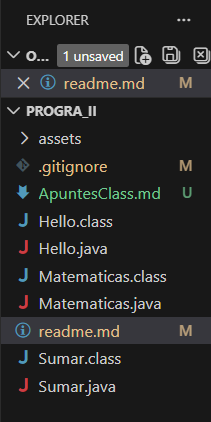
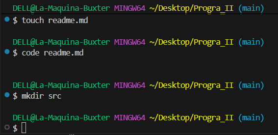

# Proyecto Inicial: PROGRA II

## Estructura de Directorios

* **PROGRA_II/**  
    **assets/** — Carpeta para recursos, imágenes e iconos.  
    **src/** — Carpeta para los codigos  
    **.gitignore** — Configuración para ignorar archivos en Git.  
    **ApuntesClass.md** — Notas y apuntes tomados durante la clase.  
    **Hello.java** — Código fuente del programa de bienvenida.  
    **Matematicas.java** — Clase con lógica de funciones matemáticas.  
    **Sumar.java** — Clase para realizar operaciones de suma  
    **readme.md** — Guía y documentación del proyecto.  
    **Archivos .class** — Archivos compilados (no editables).

---

**image**  

**terminal del git**  

> [!NOTE]  
> nota
